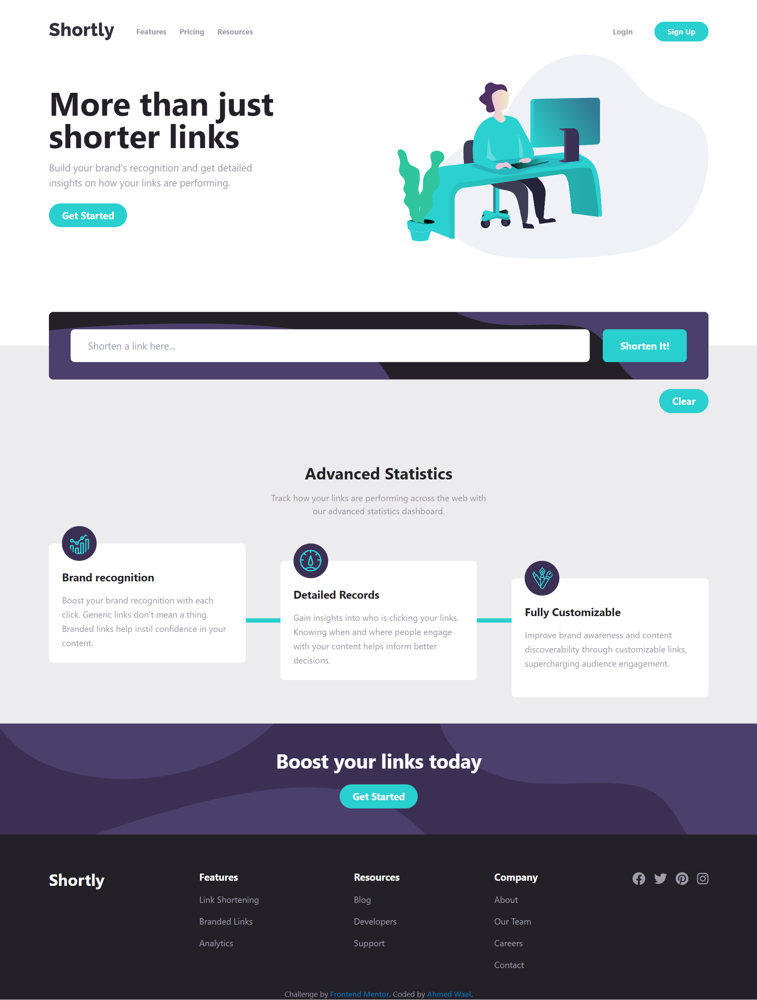

# Frontend Mentor - Shortly URL shortening API Challenge solution

This is a solution to the [Shortly URL shortening API Challenge challenge on Frontend Mentor](https://www.frontendmentor.io/challenges/url-shortening-api-landing-page-2ce3ob-G). Frontend Mentor challenges help you improve your coding skills by building realistic projects.

## Table of contents

- [The challenge](#the-challenge)
- [Screenshot](#screenshot)
- [Links](#links)
- [Built with](#built-with)
- [Author](#author)

### The challenge

Users should be able to:

- View the optimal layout for the site depending on their device's screen size
- Shorten any valid URL
- See a list of their shortened links, even after refreshing the browser
- Copy the shortened link to their clipboard in a single click
- Clear all the shortened links
- Receive an error message when the `form` is submitted if:
  - The `input` field is empty
  - The link is already shorten

### Screenshot

### Links

- Solution URL: [Solution](https://www.frontendmentor.io/challenges/url-shortening-api-landing-page-2ce3ob-G/hub/url-shortening-api-landing-page-aP9d96xS5l)
- Live Site URL: [Demo](https://jahmd.github.io/URL_shortening/)

### Built with

- Semantic HTML5 markup
- CSS custom properties
- Tailwind css
- Flexbox
- CSS Grid
- Mobile-first workflow
- Vanilla JS
- [shrtcode API](https://shrtco.de/docs) - For styles

## Author

- Frontend Mentor - [@JAHMD](https://www.frontendmentor.io/profile/JAHMD)
- Twitter - [@Nrd_kirito](https://twitter.com/Nrd_kirito)
